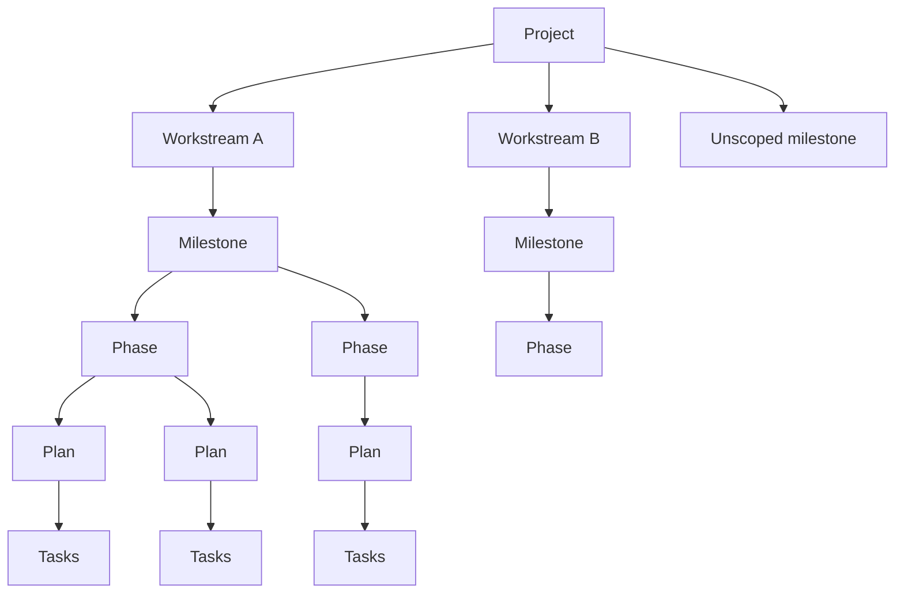
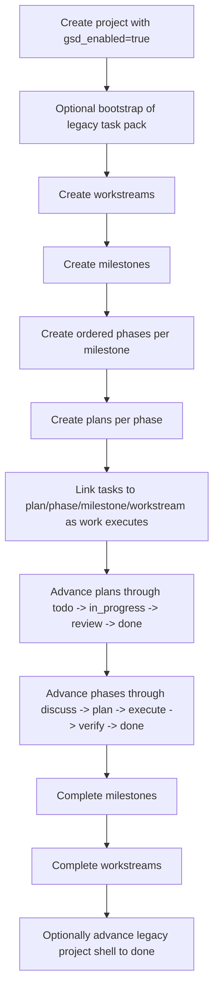

# GSD End-to-End Flow Map (Mission Control)

Purpose: one canonical operator and agent map of how GSD runs in Mission Control after Phase 10, including the legacy project shell, the hierarchical execution model, the main mutation paths, dependency/conflict rules, and live event refresh behavior.

Last updated: 2026-04-21
Sources: `docs/agent-gsd-guide.md`, `src/app/api/projects/[id]/gsd/lifecycle-graph/route.ts`, `src/lib/gsd-hierarchy.ts`, `src/lib/event-bus.ts`

---

## 1) System layers (mental model)

Mission Control now runs GSD on two layers at once:

- Project shell:
  - `discuss -> plan -> execute -> verify -> done`
  - still used for bootstrap, top-level gating, and backward compatibility with Phase 9 projects
- Hierarchy layer:
  - `project -> workstreams -> milestones -> phases -> plans -> tasks`
  - this is now the primary planning and execution structure for Phase 10 projects

Core point:
- the project shell remains linear and server-enforced
- the hierarchy layer lets one project carry multiple active workstreams and milestones in parallel
- the Lifecycle tab reads a single graph endpoint and can create, edit, complete, and transition hierarchy entities directly

---

## 2) Canonical hierarchy

Key properties:

- Workstreams are optional project-level tracks
- Milestones may belong to a workstream or remain project-scoped
- Phases belong to one milestone
- Plans belong to one phase
- Tasks can be linked to workstream, milestone, phase, and plan IDs
- Dependencies are scoped:
  - phase dependencies must stay within the same milestone
  - plan dependencies must stay within the same phase

---

## 3) Status and transition rules

### Workstreams

- Statuses: `active | paused | complete`
- Main operations:
  - create
  - edit key/name/status
  - complete

### Milestones

- Statuses: `planned | active | complete | archived`
- Main operations:
  - create
  - edit workstream assignment, version label, title, status, timestamps
  - complete

### Phases

- Lifecycle phases: `discuss | plan | execute | verify | done`
- Statuses: `planned | active | complete | deferred`
- Main operations:
  - create
  - edit key/slug/lifecycle/status/order/dependencies
  - transition lifecycle forward

Phase transition rules:

- lifecycle transitions are strictly linear
- moving past `discuss` is blocked if:
  - dependency phases are incomplete, or
  - earlier ordered phases in the same milestone are incomplete

Conflict codes:

- `DEPENDENCY_BLOCKED`
- `PHASE_ORDER_BLOCKED`
- `ILLEGAL_TRANSITION`

### Plans

- Statuses: `todo | in_progress | review | done | failed`
- Main operations:
  - create
  - edit ref/title/wave/status/dependencies
  - transition status through the server-side plan state machine

Plan transition rule:

- moving a plan to `in_progress` is blocked until all depended-on plans in the same phase are `done`

Conflict code:

- `PLAN_DEPENDENCY_BLOCKED`

---

## 4) Read model and UI behavior

Canonical read endpoint:

- `GET /api/projects/:id/gsd/lifecycle-graph`

What it returns:

- project shell fields (`gsd_enabled`, `gsd_track`, `gsd_phase`, `gsd_gate_mode`, `gsd_updated_at`)
- rollups for active workstreams, milestones, phases, in-progress plans, and blocked gates
- nested `workstreams -> milestones -> phases -> plans`
- `unscopedMilestones`
- legacy metadata:
  - `enabled`
  - `current_phase`
  - `track`
  - `gate_mode`
  - `task_counts`
  - `fallback_active`

Lifecycle tab behavior:

1. If GSD is not enabled, show the non-GSD empty state
2. If no hierarchy exists but legacy shell/tasks do, use legacy fallback mode
3. If hierarchy exists, render the full interactive hierarchy UI

The tab is not read-only anymore. It now supports:

- create workstreams, milestones, phases, plans
- inline metadata editing for all four levels
- milestone reassignment between workstreams
- dependency selection with scoped checkboxes
- complete actions for workstreams and milestones
- lifecycle/status transitions for phases and plans

---

## 5) Canonical execution flow

Notes:

- bootstrap remains useful for legacy shell seeding and gate-task packs
- hierarchy execution does not require flattening one workstream into one project anymore
- legacy shell and hierarchy can coexist in the same project during migration

---

## 6) Trigger map

### Legacy shell triggers

- `POST /api/projects`
  - effect: create a project with optional `gsd_enabled`, `gsd_track`, `gsd_gate_mode`
- `POST /api/projects/:id/gsd/bootstrap`
  - effect: seed the default Phase 9 task pack
- `POST /api/projects/:id/gsd/transition`
  - effect: advance the project shell if preconditions pass
- `PATCH /api/tasks/:id/gate`
  - effect: approve or reject gate-required legacy tasks

### Hierarchy create/edit triggers

- `POST /api/projects/:id/gsd/workstreams`
- `PATCH /api/projects/:id/gsd/workstreams/:ws_id`
- `POST /api/projects/:id/gsd/workstreams/:ws_id/complete`
- `POST /api/projects/:id/gsd/milestones`
- `PATCH /api/projects/:id/gsd/milestones/:milestone_id`
- `POST /api/projects/:id/gsd/milestones/:milestone_id/complete`
- `POST /api/gsd/milestones/:milestone_id/phases`
- `PATCH /api/gsd/phases/:phase_id`
- `POST /api/gsd/phases/:phase_id/transition`
- `POST /api/gsd/phases/:phase_id/plans`
- `PATCH /api/gsd/plans/:plan_id`
- `POST /api/gsd/plans/:plan_id/transition`

### Live refresh triggers

The Lifecycle tab listens to `GET /api/events` and refetches the graph when it sees matching project-scoped `gsd.*` events.

It also turns `gsd.conflict.detected` into readable error banners for:

- blocked phase dependencies
- blocked earlier phases
- blocked plan dependencies

---

## 7) Event contract used for orchestration

Primary hierarchy events:

- `gsd.workstream.created`
- `gsd.workstream.updated`
- `gsd.workstream.completed`
- `gsd.milestone.created`
- `gsd.milestone.updated`
- `gsd.milestone.completed`
- `gsd.phase.created`
- `gsd.phase.updated`
- `gsd.phase.transitioned`
- `gsd.plan.created`
- `gsd.plan.updated`
- `gsd.plan.transitioned`
- `gsd.conflict.detected`

Legacy events still matter:

- `project.gsd.transition`
- `task.gate.changed`
- `task.updated`
- `activity.created`

Recommended orchestration use:

- `gsd.phase.transitioned` wakes downstream phase-specific automation
- `gsd.plan.transitioned(done)` unblocks dependent plan watchers
- `gsd.conflict.detected` should be treated as deterministic control feedback, not an unknown runtime error
- `project.gsd.transition` still signals high-level shell progress

---

## 8) Failure modes to expect

- `409 ILLEGAL_TRANSITION`
  - attempted out-of-order phase or plan transition
- `409 DEPENDENCY_BLOCKED`
  - dependent phases not complete
- `409 PHASE_ORDER_BLOCKED`
  - earlier ordered phases not complete
- `409 PLAN_DEPENDENCY_BLOCKED`
  - dependent plans not done
- `409 OPTIMISTIC_LOCK_FAILED`
  - entity changed since the caller last read it
- `400 INVALID_DEPENDENCIES`
  - dependency IDs cross milestone/phase scope or self-reference
- `404 WORKSTREAM_NOT_FOUND`
  - milestone reassignment target does not exist in the project

Design implication:

- agents should refetch the lifecycle graph after a mutation failure before retrying
- callers should send `expected_updated_at` on PATCH and complete/transition requests when they have it

---

## 9) Recommended operating pattern

For new GSD projects:

1. Enable GSD on the project
2. Bootstrap only if you still want the default legacy gate/task pack
3. Build the real execution model in the hierarchy:
   - workstreams
   - milestones
   - phases
   - plans
4. Run work at the plan/task layer
5. Transition plans and phases as dependencies clear
6. Use SSE for refresh and conflict feedback
7. Keep the project shell for top-level reporting and backward compatibility until Phase 10 rollout is fully absorbed

---

## 10) What remains intentionally incomplete

Current gaps relative to the reference model are now mostly orchestration polish, not missing primitives:

- phase/plan dependency and wave-conflict enforcement is implemented server-side (`WAVE_CONFLICT_BLOCKED` and `rollups.wave_conflicts` are live)
- dedicated CLI wrappers for hierarchy CRUD/transitions are implemented (`pnpm mc projects ...`, `pnpm mc gsd ...`)
- dedicated MCP wrappers for hierarchy CRUD/transitions are implemented in `scripts/mc-mcp-server.cjs`

The remaining work is policy-level automation and operator defaults (queue routing, guardrails, and reporting ergonomics), not core API/CLI/MCP capability gaps.
