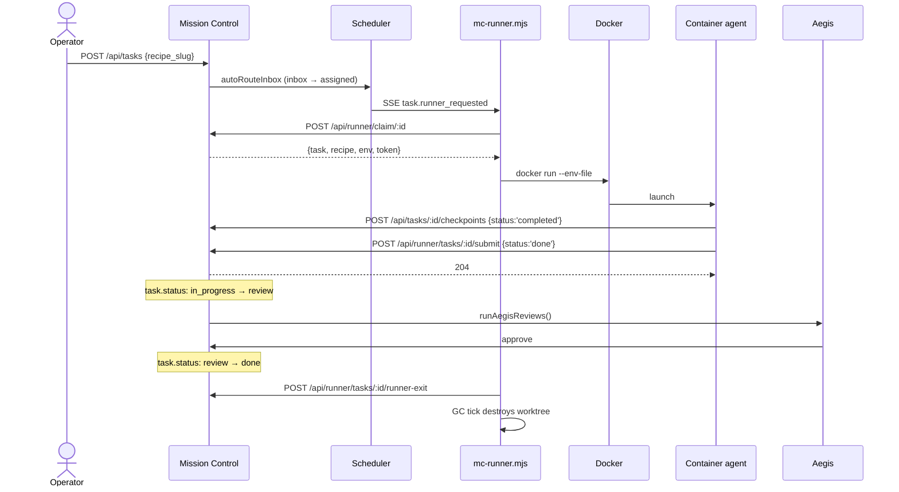

# Mission Control Runtime Documentation

This directory documents the **v1.2 recipe-based ephemeral agent runtime**. Six reference documents organized by surface plus an end-to-end tutorial. Operators new to the runtime should start with [Getting Started](./getting-started.md); recipe authors, agent-image authors, and admins can jump directly to the surface they need.

The runtime is **tool-agnostic** — any container image that honors the agent contract (env vars, preamble, filesystem layout, submit endpoint) works. Mission Control does not assume Claude Code, Aegis, or any specific agent SDK.

## 5-minute architecture overview

A `recipe` is authored as a directory under `recipes/<slug>/` containing `recipe.yaml` and `SOUL.md`. On server boot the indexer walks the recipes root and upserts each `recipe.yaml` into the `recipes` table; a `chokidar` watcher keeps the DB in sync with on-disk edits, and admins can force a full re-index via `POST /api/recipes/resync`. See [`recipes.md`](./recipes.md).

A `task` can be tagged with `recipe_slug`, optional `read_only_mounts`, `extra_skills`, and `model_override`. When the scheduler transitions a recipe-tagged task from `inbox` to `assigned`, it emits `task.runner_requested` on the event bus. See [`task-board-surfaces.md`](./task-board-surfaces.md) for how this looks in the UI.

The **runner daemon** (`scripts/mc-runner.mjs`) polls and subscribes to `task.runner_requested`, atomically claims tasks via `POST /api/runner/claim/:id`, seeds `.mc/` inside a per-task git worktree (or the project worktree root when `workspace_mode: readonly | none`), and launches a recipe-declared Docker container with a runner-token that is scoped to exactly the endpoints the agent needs. See [`runner-daemon.md`](./runner-daemon.md) and [`admin-config.md`](./admin-config.md).

Inside the container, a **tool-agnostic agent** reads `/recipe/PREAMBLE.md` + `/recipe/SOUL.md`, does its work, appends progress lines to `.mc/progress.md`, optionally POSTs `{status:'completed'}` checkpoints to `/api/tasks/:id/checkpoints`, and finally POSTs `{status:'done'}` to `/api/runner/tasks/:id/submit`. The server flips the task from `in_progress` to **`review`** (not `done`) — Aegis then approves the task to `done`, producing the shipped **two-hop terminal transition**. See [`agent-contract.md`](./agent-contract.md).

## Documentation map

| Doc | Audience | Start here if... |
|---|---|---|
| [getting-started.md](./getting-started.md) | New operator | "I want to run my first recipe agent end-to-end" |
| [recipes.md](./recipes.md) | Recipe author | "I want to author or debug a recipe" |
| [runner-daemon.md](./runner-daemon.md) | Operator deploying | "I want to run the runner in production" |
| [admin-config.md](./admin-config.md) | Admin tuning | "I want to understand `runtime.*` settings, secrets, and limits" |
| [agent-contract.md](./agent-contract.md) | Agent-image author | "I want to build a new recipe container image" |
| [task-board-surfaces.md](./task-board-surfaces.md) | Operator using the UI | "I want to know what a UI element means" |

## Authoritative external references

These files live **outside** `docs/runtime/` and remain the canonical deep references for their areas. The docs above link to them rather than duplicate their content.

- [`scripts/README.runner.md`](../../scripts/README.runner.md) — authoritative runner-daemon CLI + LaunchAgent + troubleshooting reference (linked from [`runner-daemon.md`](./runner-daemon.md))
- [`docker/hello-world-agent/README.md`](../../docker/hello-world-agent/README.md) — canonical reference image that implements every side of the agent contract end-to-end (linked from [`agent-contract.md`](./agent-contract.md))
- [`docs/superpowers/specs/2026-04-18-recipe-agent-system-design.md`](../superpowers/specs/2026-04-18-recipe-agent-system-design.md) — the original DESIGN-ERA spec. ⚠️ Several claims no longer match shipped code (the legacy direct-to-done submit lifecycle, `ro-overlay` workspace mode, embedded embeddings for recipe search). Use for historical context only; every shipped-behavior claim belongs to the docs in this directory.

## Related milestone docs

- [`.planning/milestones/v1.2-MILESTONE-AUDIT.md`](../../.planning/milestones/v1.2-MILESTONE-AUDIT.md) — 72/72 requirements audit report for the v1.2 milestone (the runtime feature set this directory documents).
- [`.planning/milestones/v1.2-REQUIREMENTS.md`](../../.planning/milestones/v1.2-REQUIREMENTS.md) — archived requirement-to-plan traceability table, including the DOC-* pseudo-requirements satisfied by this documentation set.

## Conventions used across these docs

- Every reference table has a **Source** column linking to the file + line where the referenced name is defined. Values drift; source files do not.
- Every fenced code block is shipped — copy-pasteable with only obvious parameter substitution (`$MC_URL`, `$MC_API_KEY`, task IDs).
- The string **`submit → review → done`** is used throughout — the agent's HTTP body says `{"status":"done"}` but the task transitions to `review`, and Aegis drives the final `review → done` flip. Any prose claiming "submit marks task done" is incorrect.
- Emoji status indicators (🟢 / 🔴) match the shipped UI text. No icon libraries — raw text/emoji per project conventions.

## What this documentation set does NOT cover

- **Framework-specific agent SDKs.** The contract documented here is an HTTP + filesystem protocol. Building a specific agent (Claude Code, a custom LangGraph worker, etc.) inside the container is the agent author's responsibility; [`agent-contract.md`](./agent-contract.md) tells them what the container must emit and consume, not how to implement it.
- **Kubernetes, multi-host, or multi-runner orchestration.** The runner daemon is single-host; each Mission Control instance drives one runner process. See [`runner-daemon.md`](./runner-daemon.md) § "Deployment topology."
- **Recipe image builds or a recipe-image registry.** Images must already exist in the local Docker daemon (`docker pull` or `docker build` happen outside Mission Control). The only MC-built image is `mc-hello-world-agent:latest` via `pnpm mc:build-hello-world`, documented in [`getting-started.md`](./getting-started.md).
- **Cross-version recipe migration.** `recipe.yaml` has a `version:` field bumped by the author; no automatic migration path is shipped. Version bumps trigger re-index via `dir_sha` change.

## Quick links by task

| I want to... | Start here |
|---|---|
| Run my first recipe agent | [getting-started.md](./getting-started.md) |
| Author a new recipe.yaml | [recipes.md § Schema](./recipes.md) |
| Build a new agent image | [agent-contract.md](./agent-contract.md) + [`docker/hello-world-agent/`](../../docker/hello-world-agent/) |
| Install the runner daemon on macOS as a LaunchAgent | [runner-daemon.md § LaunchAgent install](./runner-daemon.md) |
| Configure `runtime.*` admin settings | [admin-config.md](./admin-config.md) |
| Understand what the RunnerStatusBanner "🟢 online" means | [task-board-surfaces.md § RunnerStatusBanner](./task-board-surfaces.md) |
| Debug a stuck task in `review` | [agent-contract.md § Submit endpoint](./agent-contract.md) + [task-board-surfaces.md § Progress tab](./task-board-surfaces.md) |
