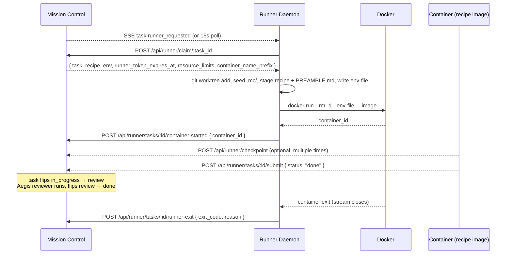

# Runner Daemon

**Source of truth:** [`scripts/mc-runner.mjs`](../../scripts/mc-runner.mjs), [`scripts/README.runner.md`](../../scripts/README.runner.md) (authoritative deep reference), [`src/lib/runner-secret.ts`](../../src/lib/runner-secret.ts), [`src/app/api/runner/config/route.ts`](../../src/app/api/runner/config/route.ts)
**Who reads this:** Operators deploying Mission Control's autonomous agent runtime
**Prerequisites:** Mission Control server reachable at `MC_URL`, Docker Desktop running, Node.js >= 22

This page is an operator-facing introduction to the runner daemon. It deliberately does NOT re-document the 160-line deep reference that lives at [`scripts/README.runner.md`](../../scripts/README.runner.md). Use this page to orient; follow the links to dive deep.

| Section | Anchor |
|---|---|
| What the runner does | [#what-the-runner-does](#what-the-runner-does) |
| Prerequisites | [#prerequisites](#prerequisites) |
| First run (foreground) | [#first-run-foreground](#first-run-foreground) |
| LaunchAgent install (macOS) | [#launchagent-install-macos](#launchagent-install-macos) |
| Boot sequence | [#boot-sequence](#boot-sequence) |
| Env vars | [#env-vars](#env-vars) |
| Exit codes | [#exit-codes](#exit-codes) |
| Logs layout | [#logs-layout](#logs-layout) |
| Configuration and secrets | [#configuration-and-secrets](#configuration-and-secrets) |
| Troubleshooting | [#troubleshooting](#troubleshooting) |
| Related docs | [#related-docs](#related-docs) |

## What the runner does

The Mission Control runner daemon (`scripts/mc-runner.mjs`) is a standalone Node ESM process that claims recipe-tagged tasks from Mission Control and drives them through ephemeral Docker containers. It is the counterpart to the REST API endpoints shipped in Phase 14 — the daemon consumes `/api/runner/*` end-to-end ([`scripts/mc-runner.mjs:1-13`](../../scripts/mc-runner.mjs#L1-L13)).

At runtime, the daemon reads `.data/runner.secret`, verifies Docker is reachable, pulls its config (project→repo map, concurrency caps, GC window) from `GET /api/runner/config`, reconciles orphaned containers from a previous run, subscribes to `task.runner_requested` SSE events with a 15s poll fallback, atomically claims tasks via `POST /api/runner/claim/:id`, seeds `.mc/` inside the task's worktree, launches the container via `docker run --rm -d`, reports the real container id via `POST /api/runner/tasks/:id/container-started`, streams stdout/stderr to `.data/runner/logs/task-<id>/attempt-<n>/`, enforces the recipe timeout, and posts `runner-exit` when the container exits. A 10-minute GC tick destroys worktrees and logs for terminal tasks.



## Prerequisites

See [`scripts/README.runner.md#prerequisites`](../../scripts/README.runner.md#prerequisites) for the authoritative list. Mirrored here for quick reference:

- Docker Desktop running (daemon reachable at the default socket)
- Node.js >= 22
- `.data/runner.secret` (auto-generates on first Mission Control boot; see [`src/lib/runner-secret.ts`](../../src/lib/runner-secret.ts))
- Mission Control server running at `MC_URL` (default `http://127.0.0.1:3000`)

## First run (foreground)

From the repository root:

```bash
node scripts/mc-runner.mjs
```

For the full boot log (expected JSON log lines) and troubleshooting, see [`scripts/README.runner.md#first-run-foreground`](../../scripts/README.runner.md#first-run-foreground).

## LaunchAgent install (macOS)

For long-running deployments on macOS, install the daemon as a LaunchAgent so it restarts automatically on crash or reboot. The authoritative 4-step procedure lives at [`scripts/README.runner.md#launchagent-install-macos`](../../scripts/README.runner.md#launchagent-install-macos); quick mirror:

1. Copy the template to `~/Library/LaunchAgents/`:
   ```bash
   cp scripts/com.missioncontrol.runner.plist ~/Library/LaunchAgents/com.missioncontrol.runner.plist
   ```
2. Search-replace `__MC_ROOT__` with the absolute repo path:
   ```bash
   sed -i '' "s|__MC_ROOT__|$(pwd)|g" ~/Library/LaunchAgents/com.missioncontrol.runner.plist
   ```
3. Load and start:
   ```bash
   launchctl load ~/Library/LaunchAgents/com.missioncontrol.runner.plist
   launchctl kickstart "gui/$(id -u)/com.missioncontrol.runner"
   ```
4. Watch logs:
   ```bash
   tail -f .data/runner/daemon.err
   tail -f .data/runner/daemon.log
   ```

`KeepAlive + ThrottleInterval 30` in the plist means launchd restarts the daemon 30s after any exit — including the clean `exit 2` when Docker is down.

## Boot sequence

The daemon's 7-step boot order is LOCKED (see Phase 14-08b locked decisions in [`.planning/STATE.md`](../../.planning/STATE.md) and the inline docblock at [`scripts/mc-runner.mjs:14-21`](../../scripts/mc-runner.mjs#L14-L21)):

1. Read `.data/runner.secret`. Exit 1 if missing or empty — the daemon's sole bearer credential; see [`scripts/mc-runner.mjs:395-402`](../../scripts/mc-runner.mjs#L395-L402).
2. `docker info`. Exit 2 if the Docker daemon is unreachable at the default socket. See [`scripts/mc-runner.mjs:408-416`](../../scripts/mc-runner.mjs#L408-L416).
3. `GET /api/runner/config`. Exit 1 if the endpoint is unreachable — **there is NO env-var fallback**. A misconfigured `/api/runner/config` must fail loud at boot rather than silently ship wrong repo paths. See [`scripts/mc-runner.mjs:435-450`](../../scripts/mc-runner.mjs#L435-L450) and [`src/app/api/runner/config/route.ts`](../../src/app/api/runner/config/route.ts).
4. Reconcile orphaned containers from the previous run. Containers that are still alive get adopted; containers that exited while the daemon was down get a `runner-exit` post with `reason='crash'`.
5. UPSERT a row in `runner_heartbeats` via `POST /api/runner/heartbeat` and start the 10-second heartbeat loop.
6. Subscribe to the `task.runner_requested` SSE stream and start the 15-second poll fallback. Both paths feed the same claim loop.
7. Start the 10-minute GC tick against `GET /api/runner/terminal-tasks`. Destroys worktrees and logs for `done`/`cancelled` tasks immediately and for `failed` tasks after `runtime.failed_gc_window_days` (default 7).

`SIGHUP` re-fetches `/api/runner/config` without a daemon restart — use it after changing `runtime.project_repo_map` or any other runner-config setting. See [`scripts/mc-runner.mjs:1163-1170`](../../scripts/mc-runner.mjs#L1163-L1170).

## Env vars

Runner-only environment variables (admin `runtime.*` settings are covered separately in [`docs/runtime/admin-config.md`](./admin-config.md)):

| Name | Type | Default | Source |
|---|---|---|---|
| `MC_URL` | URL | `http://127.0.0.1:3000` | [`scripts/mc-runner.mjs:49`](../../scripts/mc-runner.mjs#L49) |
| `MISSION_CONTROL_DATA_DIR` | absolute path | `<cwd>/.data` | [`scripts/mc-runner.mjs:48`](../../scripts/mc-runner.mjs#L48) |
| `MISSION_CONTROL_RECIPES_DIR` | absolute path | `<cwd>/recipes` | [`scripts/mc-runner.mjs:1047-1048`](../../scripts/mc-runner.mjs#L1047-L1048) |
| `RUNNER_ID` | string | `runner-<hostname>-<pid>` | [`scripts/mc-runner.mjs:50`](../../scripts/mc-runner.mjs#L50) |
| `PORT` | int | `3000` | consumed by composed `MC_API_URL` (`http://host.docker.internal:${PORT}`) at [`scripts/mc-runner.mjs:1036`](../../scripts/mc-runner.mjs#L1036) |

All claim-time / container-behavior knobs (concurrency caps, resource limits, project→repo map, mount allowlist, GC window) live in the `runtime.*` admin settings, not env vars. See [`docs/runtime/admin-config.md`](./admin-config.md).

## Exit codes

| Code | Meaning |
|---|---|
| 1 | Bootstrap failed — `.data/runner.secret` missing, or `GET /api/runner/config` unreachable |
| 2 | Docker daemon unreachable |
| 0 | Graceful shutdown (SIGINT/SIGTERM) |

Defined at [`scripts/mc-runner.mjs:34-36`](../../scripts/mc-runner.mjs#L34-L36) (exit-code docblock) with call sites at [`scripts/mc-runner.mjs:401`](../../scripts/mc-runner.mjs#L401) (secret missing), [`scripts/mc-runner.mjs:415`](../../scripts/mc-runner.mjs#L415) (Docker unreachable), [`scripts/mc-runner.mjs:449`](../../scripts/mc-runner.mjs#L449) (config unreachable), and [`scripts/mc-runner.mjs:1157`](../../scripts/mc-runner.mjs#L1157) (graceful shutdown).

## Logs layout

Per attempt:

```
.data/runner/logs/task-<id>/
├── attempt-<n>/
│   ├── stdout.log
│   ├── stderr.log
│   └── meta.json   { started_at, runner_id, container_id, exited_at?, exit_code?, reason? }
└── latest → attempt-<n>
```

`latest` is a **relative** symlink (not absolute) — `.data/runner/logs/` stays portable if moved. To follow a live run, point `tail -f` at the symlink:

```bash
tail -f .data/runner/logs/task-42/latest/stderr.log
```

See [`scripts/README.runner.md#logs-layout`](../../scripts/README.runner.md#logs-layout) for the full reference.

## Configuration and secrets

The daemon is configured via admin settings (`runtime.*`), not env vars. See [`docs/runtime/admin-config.md`](./admin-config.md) for the full settings reference and the detailed secrets-store procedure.

> **Warning — secrets never flow on `docker run` argv (CONTAINER-01 invariant).**
>
> The CONTAINER-01 invariant forbids any `docker run -e SECRET=value` argv pattern. All secrets — including `MC_API_TOKEN` and every env var name listed in `recipe.secrets` — flow via `docker run --env-file`, never via `--env KEY=VALUE` flags on the command line. Argv is visible to any local user via `ps`; env-files live at `0600` perms under `.data/runner/env/` and are deleted after container exit.
>
> The recommended way to provision a secret is:
>
> ```bash
> install -m 0600 /dev/stdin .data/runner/secrets/ANTHROPIC_API_KEY <<<'sk-...'
> ```
>
> The invariant is enforced by a unit test at [`src/lib/__tests__/runner-docker.test.ts`](../../src/lib/__tests__/runner-docker.test.ts) that scans every argv element for a `MC_API_TOKEN=` substring and asserts it is absent. See also [`docs/runtime/admin-config.md#secrets-store`](./admin-config.md#secrets-store) for the full secrets story and [`docs/runtime/admin-config.md#standalone-mode-requirements`](./admin-config.md#standalone-mode-requirements) for deployment caveats.

## Troubleshooting

See [`scripts/README.runner.md#troubleshooting`](../../scripts/README.runner.md#troubleshooting) for the canonical list. The four most common failure modes:

- **runner exits 1 (`runner.secret missing`)** — run `pnpm dev` once to auto-generate the secret, then re-launch the runner.
- **runner exits 2** — Docker daemon is not reachable. Open Docker Desktop and wait for the whale icon to stop animating, then the LaunchAgent will pick it up after `ThrottleInterval 30`.
- **task stays in `assigned`** — tail `.data/runner/daemon.log` for claim errors (HTTP status codes, schema mismatches). A common cause is a missing `runtime.project_repo_map` entry for the task's `workspace_source.project_id`.
- **container starts but immediately exits** — check `.data/runner/logs/task-<id>/latest/stderr.log`. Common causes: missing recipe-declared secret, bad `MC_API_URL`, image entrypoint crash.

## Related docs

- [`docs/runtime/admin-config.md`](./admin-config.md) — all `runtime.*` admin settings, secrets store, auth tiers, data-directory layout
- [`docs/runtime/agent-contract.md`](./agent-contract.md) — what the container does once launched
- [`docs/runtime/task-board-surfaces.md#runner-status-banner`](./task-board-surfaces.md#runner-status-banner) — how runner health surfaces in the UI
- [`scripts/README.runner.md`](../../scripts/README.runner.md) — authoritative deep reference (keep here for as long as this repo is maintained)
- [`docs/runtime/getting-started.md`](./getting-started.md) — end-to-end tutorial for provisioning + running a recipe agent
