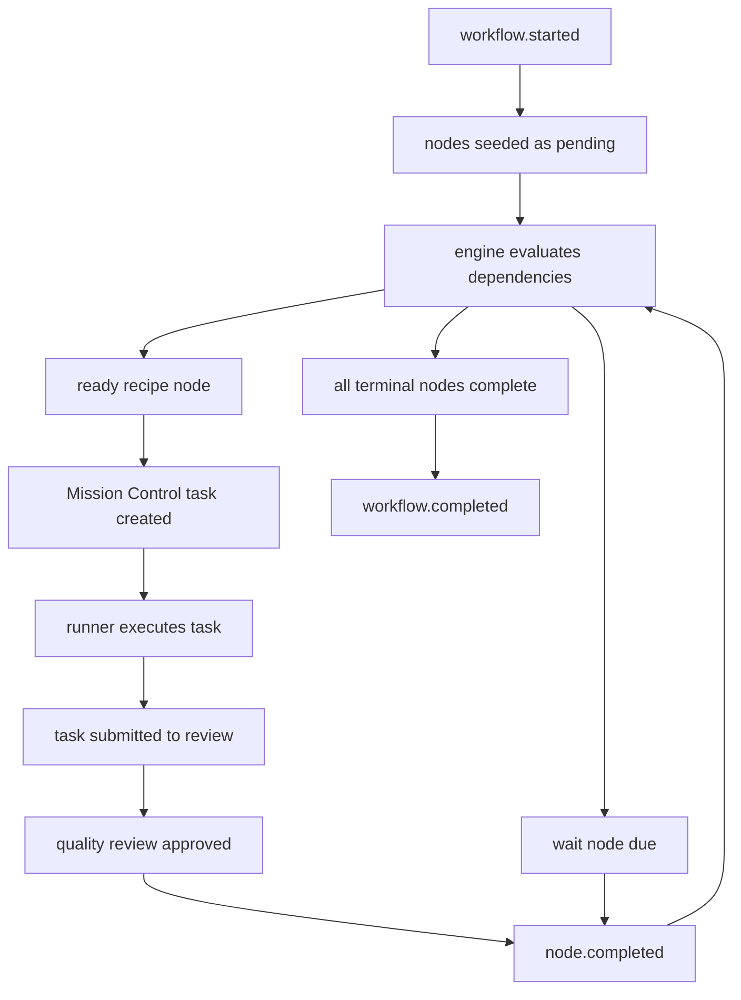

# Workflow Engine v1

Mission Control workflows are reusable node graphs that can run against any subject:
a FirmVault case, a project, a GSD plan, or an ad hoc request.

The core rule is simple: workflow definitions are authored config, workflow
instances are runtime state. A YAML file describes the process. SQLite records
what actually happened.

## Goals

- Make multi-step agent work auditable from start to finish.
- Let recipe tasks satisfy dependencies for later recipe tasks.
- Support human and agent review gates.
- Support timers and waits.
- Keep the core generic. FirmVault landmarks are one condition namespace, not a
  workflow-engine dependency.
- Allow main agents or orchestrators to create one-off workflows later by writing
  valid workflow YAML.

## Runtime Objects

```text
workflow_definition
  reusable YAML blueprint

workflow_instance
  one running copy against a subject

workflow_node_instance
  one runtime row for one node in that workflow instance

workflow_event
  append-only audit event
```

Every task, review, wait, blocker, and completion hangs from a
`workflow_instance_id`. The task runner is still task-scoped, but task metadata
links the task back to the workflow instance and node instance.

## Definition Shape

```yaml
schema_version: 1
id: lien-resolution
name: Lien Resolution
version: 1
subject_type: law_firm_case

vars:
  case_slug:
    description: FirmVault case slug.
    required: true
    type: string
  lien_scope:
    description: Optional lien holder filter.
    default: all
    type: string

triggers:
  - type: manual
  - type: condition
    condition: law_firm.landmarks.liens_identified == true

nodes:
  identify_liens:
    type: recipe
    recipe: firmvault-identify-liens
    description: Check the case file and lien folder before creating new lien work.
    completes:
      - law_firm.landmarks.liens_identified

  open_liens:
    type: recipe
    recipe: firmvault-open-liens
    description_file: workflows/lien-resolution/open-liens.md
    depends_on:
      - identify_liens
    review:
      mode: agent
      recipe: firmvault-lien-review
      max_rounds: 2
      fallback: human

  wait_for_treatment_complete:
    type: wait
    depends_on:
      - open_liens
    until:
      condition: law_firm.landmarks.treatment_complete == true

  request_final_amounts:
    type: recipe
    recipe: firmvault-request-final-liens
    depends_on:
      nodes:
        - open_liens
      conditions:
        - law_firm.landmarks.treatment_complete == true

  follow_up_after_30_days:
    type: recipe
    recipe: firmvault-follow-up-final-liens
    depends_on:
      nodes:
        - request_final_amounts
      timers:
        - after: request_final_amounts
          duration: 30d
      conditions:
        - law_firm.landmarks.final_amounts_received != true
```

## Variables

Workflows can declare reusable variables under `vars`. A variable can be a
simple scalar default or an object with metadata:

```yaml
vars:
  case_slug:
    description: FirmVault case slug.
    required: true
    type: string
  follow_up_days: 30
```

Variables are definition metadata for now. They give orchestrators, future
workflow builders, and UI forms a contract for what must be supplied when a
workflow instance is started. The runtime does not yet template-substitute
workflow YAML from these values.

## Triggers

Use `triggers` for workflow activation rules. `trigger` is still accepted as a
legacy alias and is normalized to a one-item `triggers` array.

```yaml
triggers:
  - type: manual
  - type: condition
    condition: law_firm.landmarks.treatment_complete == true
  - type: event
    on: case.landmark.satisfied
  - type: cooldown
    interval: 30d
  - type: cron
    schedule: "0 9 * * 1"
```

Supported trigger types:

- `manual`: user or orchestrator starts the workflow explicitly.
- `condition`: a named condition, such as a FirmVault landmark expression,
  opens the workflow.
- `event`: a workflow starts when a matching system event is observed.
- `cooldown`: elapsed-time activation, useful for repeating patrol-style work.
- `cron`: calendar-style activation.

The current implementation validates and stores these triggers in the workflow
YAML. Automatic trigger dispatch is a later layer; condition dependencies inside
running workflow instances are already push-satisfied through
`POST /api/workflow-dependencies/satisfy`.

`depends_on` can be the legacy shorthand list of node keys or the expanded
object form:

```yaml
depends_on:
  nodes:
    - identify_lien
  conditions:
    - law_firm.landmarks.treatment_complete == true
  timers:
    - after: send_medical_records_request
      duration: 30d
```

Node dependencies can also carry Beads-style semantics. Plain strings are
treated as `blocks`.

```yaml
depends_on:
  nodes:
    - draft_request
    - node: alternate_source
      type: related
    - node: insurer_response
      type: waits_for_any
      group: response_or_timeout
    - node: follow_up_timer
      type: waits_for_any
      group: response_or_timeout
```

Supported dependency semantics:

- `blocks`: the downstream node waits until this node completes.
- `waits_for_all`: same blocking behavior as `blocks`, but clearer for fan-in
  gates.
- `waits_for_any`: the downstream node waits until one dependency in the same
  group completes.
- `conditional_on_failure`: reserved for failure branches. It is stored and
  auditable, but failure-branch automation is a later layer.
- `related`: records graph context without blocking readiness.

The expanded form creates runtime dependency rows. Those rows are the mutable
state; the YAML remains the reusable blueprint.

## Node Types

- `recipe`: materializes a normal Mission Control task backed by a recipe.
- `review`: creates a human or agent review gate.
- `wait`: waits until a duration expires or an exit condition becomes true.
- `code`: reserved for deterministic functions.
- `gateway`: reserved for branching.
- `gate`: a generic non-task gate. Use this when a workflow needs to wait on a
  human, timer, external condition, or future deterministic check without
  pretending the gate is an agent recipe task.

This mirrors the useful part of Beads' formula/proto/molecule model:

- workflow YAML = reusable formula/prototype
- workflow instance = one running molecule for a case/project/request
- workflow node = a graph node
- Mission Control task = materialized agent/human work for a ready recipe node
- dependency rows = the auditable gate/blocker state for that node

## Node Instructions

Recipe and review nodes can include short inline instructions and/or a reference
to a longer instruction file:

```yaml
nodes:
  request_records:
    type: recipe
    recipe: firmvault-medical-records-send-request
    description: Confirm the request packet before drafting the send handoff.
    description_file: recipes/firmvault-medical-records-send-request/references/sending-methods.md
```

When a recipe node materializes into a Mission Control task, the task
description includes the node goal from `config.task_goal`, the inline
`description`, and the `description_file` path. The recipe itself still owns the
runner's SOUL.md, tools, references, model, workspace, and review.md.

## Lifecycle



Nothing starts the next step directly. Every change emits an event. The
dependency index updates only the workflow nodes waiting on that dependency.
When all dependency rows for a node are satisfied, that node becomes ready and
the materializer can create the task.

When a linked recipe task passes quality review, the approval path completes the
workflow node, records `node.completed`, reevaluates the workflow, and
materializes any newly ready recipe nodes as Mission Control tasks. Newly
materialized follow-up tasks default to the inbox unless the workflow caller
explicitly assigns them, so a runner does not pick up downstream work until a
human or orchestrator intentionally moves it forward.

Timer dependencies are advanced by `POST /api/workflow-timers/run`. The timer
poller uses an indexed `due_at` lookup, not a full workflow scan. It finds
scheduled timer dependencies whose `due_at` has passed, marks those dependencies
satisfied, promotes any nodes whose remaining dependencies are now satisfied,
and materializes newly ready recipe nodes. This is deterministic and idempotent:
once a timer dependency is satisfied, later timer runs ignore it.

Condition dependencies are pushed through
`POST /api/workflow-dependencies/satisfy`. For example, when a case updates
`treatment_complete`, the case layer can satisfy
`law_firm.landmarks.treatment_complete == true`; the dependency engine then
updates only nodes waiting on that exact condition for that subject.

## FirmVault Test Ladder

FirmVault workflow tests use synthetic cases under the normal FirmVault
`cases/` tree. These cases use the reserved `test-ladder-*` slug prefix and
frontmatter `workflow_test: true`, so Mission Control and the vault see them as
ordinary cases while operators can still distinguish them from real matters.

Global FirmVault workflow automation remains disabled while Phase 0 is under
test. Tests and operators manually start workflow instances for specific
synthetic case slugs, then call the normal materialization path. This exercises
the same workflow instance, node, task, recipe, and review machinery used by
real cases without scanning or materializing work for the rest of the vault.

## Audit Trail

The append-only `workflow_events` table answers:

- Who or what started the workflow?
- Which node created which task?
- Which runner attempt did the work?
- What checkpoints, comments, and reviews happened?
- Why was a node blocked?
- Why did the workflow complete, cancel, or escalate?

That audit trail is how we improve recipes and workflows later. If a node blocks
every time, the workflow definition or recipe needs work. If a reviewer rejects
the same recipe repeatedly, that recipe needs better instructions, tools, or
workspace constraints.

## First Implementation Slice

v1 creates the generic runtime substrate:

- `workflow_definitions`
- `workflow_instances`
- `workflow_node_instances`
- `workflow_node_dependencies`
- `workflow_events`
- YAML parser and validator
- workflow instance starter
- evaluator that marks eligible pending nodes as `ready`
- materializer that turns ready `recipe` nodes into Mission Control tasks
- approval bridge that completes a linked node and materializes the next ready
  recipe nodes
- timer bridge that completes due `wait` nodes and materializes the next ready
  recipe nodes
- APIs for registering definitions and starting instances:
  - `POST /api/workflow-definitions`
- `POST /api/workflow-instances`
- `POST /api/workflow-instances/:id/materialize`
- `POST /api/workflow-dependencies/satisfy`
- `POST /api/workflow-timers/run`
- event writer

Review-loop orchestration builds on top of this substrate.
