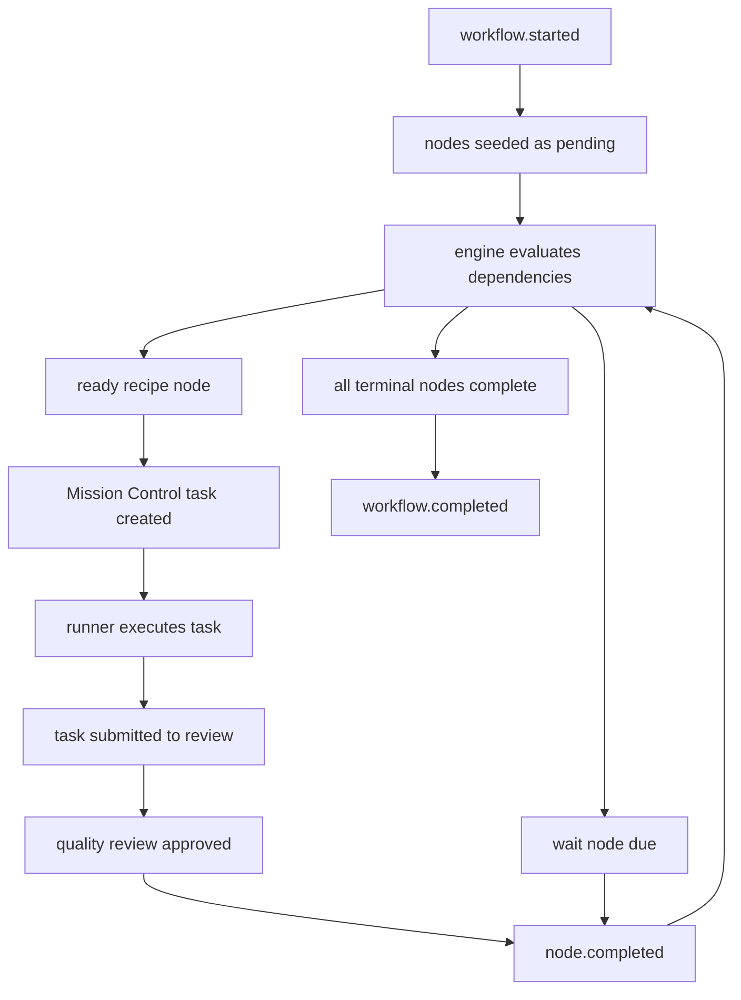

# Workflow Engine v1

Mission Control workflows are reusable node graphs that can run against any subject:
a FirmVault case, a project, a GSD plan, or an ad hoc request.

The core rule is simple: workflow definitions are authored config, workflow
instances are runtime state. A YAML file describes the process. SQLite records
what actually happened.

## Goals

- Make multi-step agent work auditable from start to finish.
- Let recipe tasks satisfy dependencies for later recipe tasks.
- Support human and agent review gates.
- Support timers and waits.
- Keep the core generic. FirmVault landmarks are one condition namespace, not a
  workflow-engine dependency.
- Allow main agents or orchestrators to create one-off workflows later by writing
  valid workflow YAML.

## Runtime Objects

```text
workflow_definition
  reusable YAML blueprint

workflow_instance
  one running copy against a subject

workflow_node_instance
  one runtime row for one node in that workflow instance

workflow_event
  append-only audit event
```

Every task, review, wait, blocker, and completion hangs from a
`workflow_instance_id`. The task runner is still task-scoped, but task metadata
links the task back to the workflow instance and node instance.

## Definition Shape

```yaml
schema_version: 1
id: lien-resolution
name: Lien Resolution
version: 1
subject_type: law_firm_case

trigger:
  type: manual_or_condition
  condition: law_firm.landmarks.liens_identified == true

nodes:
  identify_liens:
    type: recipe
    recipe: firmvault-identify-liens
    completes:
      - law_firm.landmarks.liens_identified

  open_liens:
    type: recipe
    recipe: firmvault-open-liens
    depends_on:
      - identify_liens
    review:
      mode: agent
      recipe: firmvault-lien-review
      max_rounds: 2
      fallback: human

  wait_for_treatment_complete:
    type: wait
    depends_on:
      - open_liens
    until:
      condition: law_firm.landmarks.treatment_complete == true

  request_final_amounts:
    type: recipe
    recipe: firmvault-request-final-liens
    depends_on:
      - wait_for_treatment_complete

  follow_up_after_30_days:
    type: wait
    depends_on:
      - request_final_amounts
    duration: 30d
    exit_when:
      condition: law_firm.landmarks.final_amounts_received == true
```

## Node Types

- `recipe`: materializes a normal Mission Control task backed by a recipe.
- `review`: creates a human or agent review gate.
- `wait`: waits until a duration expires or an exit condition becomes true.
- `code`: reserved for deterministic functions.
- `gateway`: reserved for branching.

## Lifecycle



Nothing starts the next step directly. Every change emits an event. The evaluator
then recomputes which nodes are ready.

When a linked recipe task passes quality review, the approval path completes the
workflow node, records `node.completed`, reevaluates the workflow, and
materializes any newly ready recipe nodes as Mission Control tasks. Newly
materialized follow-up tasks default to the inbox unless the workflow caller
explicitly assigns them, so a runner does not pick up downstream work until a
human or orchestrator intentionally moves it forward.

Timer nodes are advanced by `POST /api/workflow-timers/run`. The timer poller
finds active `wait` nodes whose `due_at` has passed, completes each wait node,
records `node.completed` with `reason: timer_due`, reevaluates dependencies, and
materializes any newly ready recipe nodes. This is deterministic and idempotent:
once a wait node is complete, later timer runs ignore it.

## Audit Trail

The append-only `workflow_events` table answers:

- Who or what started the workflow?
- Which node created which task?
- Which runner attempt did the work?
- What checkpoints, comments, and reviews happened?
- Why was a node blocked?
- Why did the workflow complete, cancel, or escalate?

That audit trail is how we improve recipes and workflows later. If a node blocks
every time, the workflow definition or recipe needs work. If a reviewer rejects
the same recipe repeatedly, that recipe needs better instructions, tools, or
workspace constraints.

## First Implementation Slice

v1 creates the generic runtime substrate:

- `workflow_definitions`
- `workflow_instances`
- `workflow_node_instances`
- `workflow_events`
- YAML parser and validator
- workflow instance starter
- evaluator that marks eligible pending nodes as `ready`
- materializer that turns ready `recipe` nodes into Mission Control tasks
- approval bridge that completes a linked node and materializes the next ready
  recipe nodes
- timer bridge that completes due `wait` nodes and materializes the next ready
  recipe nodes
- APIs for registering definitions and starting instances:
  - `POST /api/workflow-definitions`
  - `POST /api/workflow-instances`
  - `POST /api/workflow-instances/:id/materialize`
  - `POST /api/workflow-timers/run`
- event writer

Review-loop orchestration builds on top of this substrate.
